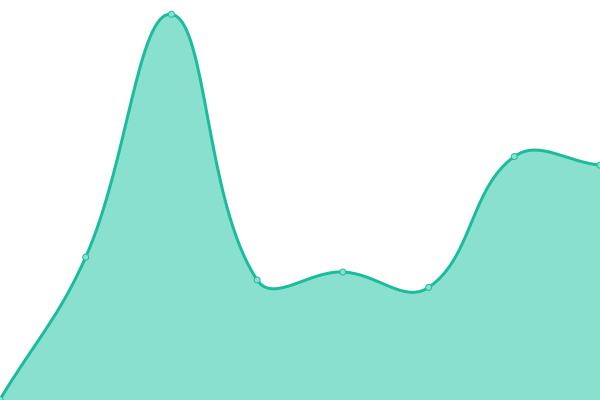
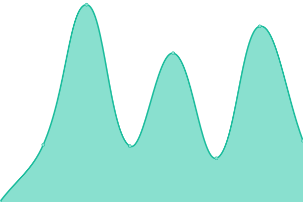

# [📈 Live Status](https://joaogpiva.github.io/upptime-hub): <!--live status--> **🟧 Indisponibilidade parcial**

This repository contains the open-source uptime monitor and status page for [João Gabriel Piva](https://joaogpiva.github.io/upptime-hub), powered by [Upptime](https://github.com/upptime/upptime).

With [Upptime](https://upptime.js.org), you can get your own unlimited and free uptime monitor and status page, powered entirely by a GitHub repository. We use [Issues](https://github.com/joaogpiva/upptime-hub/issues) as incident reports, [Actions](https://github.com/joaogpiva/upptime-hub/actions) as uptime monitors, and [Pages](https://joaogpiva.github.io/upptime-hub) for the status page.

<!--start: status pages-->
<!-- This summary is generated by Upptime (https://github.com/upptime/upptime) -->
<!-- Do not edit this manually, your changes will be overwritten -->
<!-- prettier-ignore -->
| URL | Status | Histórico | Tempo de resposta | Uptime total |
| --- | ------ | ------- | ------------- | ------ |
|  [Plataforma](https://app.hub2b.com.br) | 🟩 Operacional | [plataforma.yml](https://github.com/joaogpiva/upptime-hub/commits/HEAD/history/plataforma.yml) | 

 309ms
     
 | 

<a href="https://joaogpiva.github.io/upptime-hub/history/plataforma">100.00%</a>
    

|  [Site quebrado](https://thissitedoesnotexist.koj.co) | 🟥 Indisponível | [site-quebrado.yml](https://github.com/joaogpiva/upptime-hub/commits/HEAD/history/site-quebrado.yml) | 

 0ms
     
 | 

<a href="https://joaogpiva.github.io/upptime-hub/history/site-quebrado">0.00%</a>
    

|  [Outro site quebrado](https://google.com.br) | 🟩 Operacional | [outro-site-quebrado.yml](https://github.com/joaogpiva/upptime-hub/commits/HEAD/history/outro-site-quebrado.yml) | 

 311ms
     
 | 

<a href="https://joaogpiva.github.io/upptime-hub/history/outro-site-quebrado">96.41%</a>
    

<!--end: status pages-->

[**Visit our status website →**](https://joaogpiva.github.io/upptime-hub)

## 📄 License

- Powered by: [Upptime](https://github.com/upptime/upptime)
- Code: [MIT](./LICENSE) © [Anand Chowdhary](https://anandchowdhary.com), supported by [Pabio](https://pabio.com)
- Data in the `./history` directory: [Open Database License](https://opendatacommons.org/licenses/odbl/1-0/)
